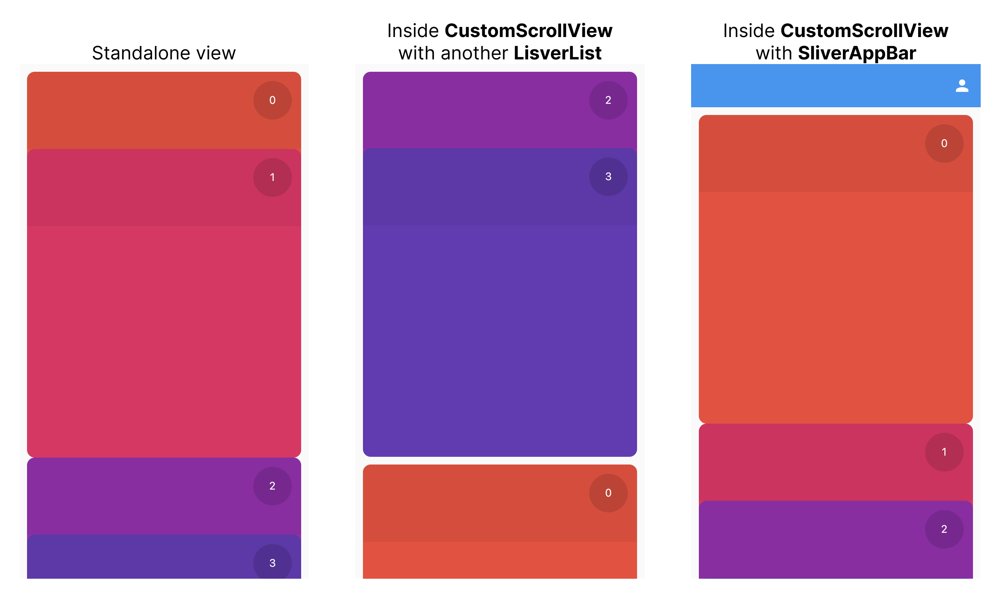

Nice and smooth Cards Reel list component respecting standard Flutter Slivers protocol.



## Getting started

Simply add as a dependency in `pubspec.yaml`

```
dependencies:
  flutter_cards_reel: any
```

## Usage

Cards Reel widget follows common Flutter lists protocol.

- `SliverCardsReel` implements all the low-level `slivers` protocol logic so that it can be combined with anything else inside the `CustomScrollView`:

```dart
  CustomScrollView(
    slivers: [
      SliverList(/* some other sliver */),
      SliverCardsReel(
        itemExtent: 400,
        itemHeaderExtent: 100,
        delegate: SliverChildBuilderDelegate(
          (context, index) {
            return Padding(
              padding: const EdgeInsets.all(10),
              child: SizedBox(
                height: 400,
                child: ColorfulCard(index),
              ),
            );
          },
          childCount: 4,
        ),
      ),
      SliverList(/* some other sliver */),
    ],
  )
```

- `CardsReelView` provides standard API for `children` and `builder` options similar to `ListView` widget:

```dart
  CardsReelView.builder(
    itemExtent: 400,
    itemHeaderExtent: 100,
    itemCount: 5,
    itemBuilder: (context, index) {
      return Padding(
        padding: const EdgeInsets.all(10),
        child: SizedBox(
          height: 400,
          child: ColorfulCard(index),
        ),
      );
    },
  )
```

- `CardsReelPhysics` provides simple cards snapping logic and is being used by `CardsReelView` widget internally

Please follow the `/example` folder for additional details.

## Additional links

- CardsReelView live video: https://youtube.com/shorts/s2iWwztQYz0
- CustomScrollView live video: https://youtube.com/shorts/7zrIKdr6vTA
